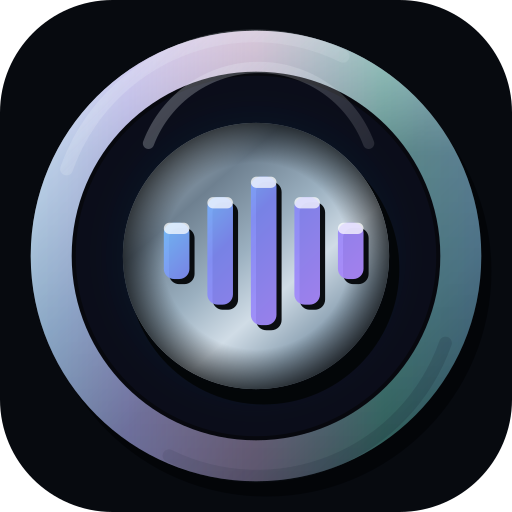
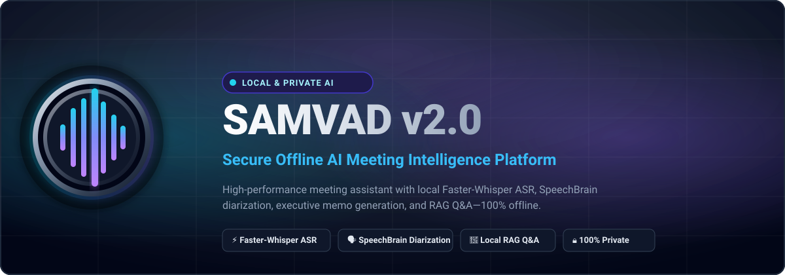
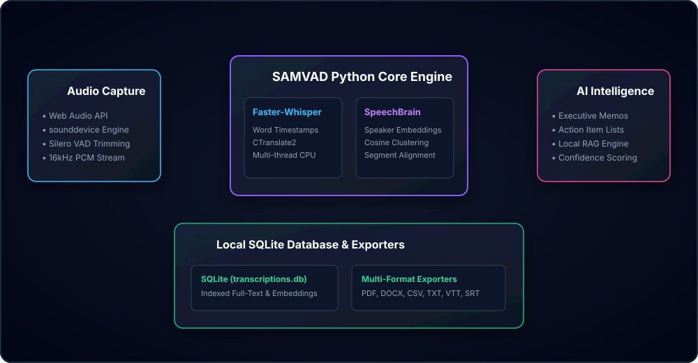
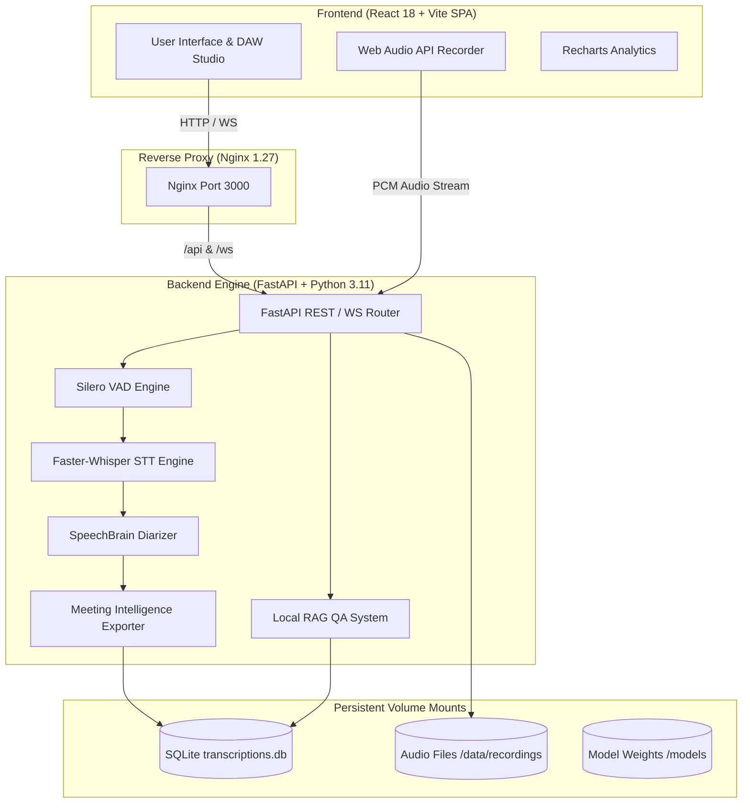
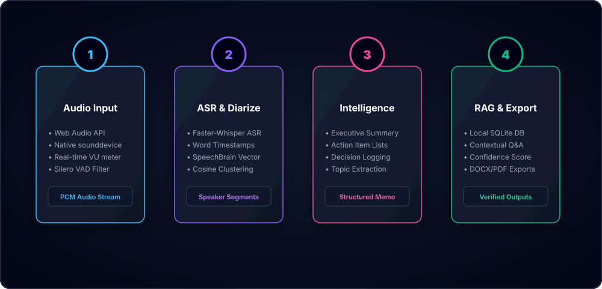

#  SAMVAD v2.0 — Secure Offline AI Meeting Intelligence Platform

[](LICENSE)
[](https://www.python.org/)
[](https://react.dev/)
[](https://fastapi.tiangolo.com/)
[](docker-compose.yml)
[](backend/tests/)

---

<p center>
  
</p>

> 🔒 **100% Private & Offline.** Processing speech, generating executive memos, performing speaker diarization, and running RAG Q&A locally on consumer hardware without sending data to the cloud.

---

## 📋 Table of Contents

- [✨ Executive Overview & Key Features](#-executive-overview--key-features)
- [🏗️ System Architecture & Dataflow](#️-system-architecture--dataflow)
- [🛠️ Deep-Dive Features](#️-deep-dive-features)
- [⚡ Quick Start & Installation](#-quick-start--installation)
  - [Option A: Running with Docker Compose (Recommended)](#option-a-running-with-docker-compose-recommended)
  - [Option B: Native Host Environment Setup](#option-b-native-host-environment-setup)
- [⚙️ Configuration Reference](#️-configuration-reference)
- [🔌 REST & WebSocket API Documentation](#-rest--websocket-api-documentation)
- [🔒 Security & Privacy Hardening](#-security--privacy-hardening)
- [❓ Frequently Asked Questions (FAQ)](#-frequently-asked-questions-faq)
- [🛠️ Troubleshooting Guide](#️-troubleshooting-guide)
- [📜 Roadmap & Governance](#-roadmap--governance)

---

## ✨ Executive Overview & Key Features

**SAMVAD v2.0** is an enterprise-grade, privacy-first meeting intelligence workstation designed for security-conscious professionals, research labs, legal teams, and healthcare providers.

### 🌟 Feature Comparison at a Glance

| Capability | SAMVAD v2.0 | Traditional Cloud ASR | Manual Transcription |
| :--- | :---: | :---: | :---: |
| **Data Privacy** | 🛡️ **100% Offline (Local)** | ❌ Cloud Upload Required | 🛡️ Internal Only |
| **API Costs** | 💰 **$0 / Unlimited** | 💳 Pay-per-minute | 💵 High Hourly Rate |
| **Speaker Separation** | 🗣️ SpeechBrain Cosine Clustering | ⚡ Basic Diarization | 🧑 Manual Identification |
| **Local RAG Q&A** | 🔮 Contextual Extractive RAG | ❌ Not Provided | ❌ Manual Search |
| **Export Formats** | 📥 DOCX, PDF, CSV, TXT, VTT, SRT | 📄 Plain Text / SRT | 📄 Manual Formatting |

<br/>

### 🎯 Key Capabilities

- **🔴 Dual-Channel Studio Audio Capture**:
  - **Browser Web Audio Studio**: High-fidelity microphone capture with real-time VU meter animations, canvas waveform display, and DAW transport controls.
  - **Native Hardware Capture**: Direct audio stream capture via Python `sounddevice` engine.
- **📝 Offline Speech-to-Text**: Powered by `Faster-Whisper` with Voice Activity Detection (`Silero VAD`), CPU multi-threading, and word-level timestamps.
- **🗣️ Speaker Diarization**: Cosine distance feature clustering (`embeddings.py`) for automatic speaker separation and re-assignment.
- **📄 Executive Meeting Intelligence**: Executive memos, action items checklists, decision logs, key points, and blocker extraction.
- **🔮 Local RAG Q&A Assistant**: Context-aware question answering with extractive confidence scoring (`qa/system.py`) and source verification.
- **📊 System Analytics & Telemetry**: Dynamic visual charts for speaking densities, duration trends, keywords, and telemetry built with `Recharts`.

---

## 🏗️ System Architecture & Dataflow

### 📐 High-Level Component Topology

<p align="center">
  
</p>

<details>
<summary><b>View Mermaid Code Diagram</b></summary>
<br/>


</details>

<br/>

### 🔄 End-to-End Processing Methodology

<p align="center">
  
</p>

---

## ⚡ Quick Start & Installation

### Option A: Running with Docker Compose (Recommended)

Requires [Docker Desktop](https://www.docker.com/products/docker-desktop/) or Docker Engine v24+.

1. **Clone & Navigate**:
   ```bash
   git clone https://github.com/priyansudas2005/SAMVAD-v2plus.git
   cd SAMVADv2
   ```

2. **Configure Environment**:
   ```bash
   cp .env.example .env
   ```

3. **Boot the Container Stack**:
   ```bash
   docker compose up --build -d
   ```

4. **Access Applications**:
   - 🌐 **React Web Client**: `http://localhost:3000`
   - 📑 **FastAPI OpenAPI Docs**: `http://localhost:8000/docs`

---

### Option B: Native Host Environment Setup

#### Prerequisites
- **Python 3.11** installed
- **Node.js 20+** installed
- **FFmpeg** installed on system PATH (`choco install ffmpeg` / `brew install ffmpeg` / `apt install ffmpeg`)

#### 1. Backend Setup
```bash
cd backend
python -m venv venv

# Activate Virtual Environment
# Windows PowerShell:
.\venv\Scripts\Activate.ps1
# Linux / macOS:
# source venv/bin/activate

pip install -r requirements.txt
python -m src.app
```

#### 2. Frontend Setup (New Terminal)
```bash
cd frontend
npm install
npm run dev
```

---

## ⚙️ Configuration Reference

System behavior is configured through `backend/config/config.yaml` and `.env`:

### Key `.env` Environment Variables

| Variable | Default Value | Description |
| :--- | :--- | :--- |
| `SAMVAD_PORT` | `3000` | Exposed host port for Nginx frontend reverse proxy. |
| `SAMVAD_DB_DIR` | `/app/data/database` | Container path for persistent SQLite database files. |
| `OMP_NUM_THREADS` | `4` | PyTorch & OpenMP CPU thread cap to prevent CPU starvation. |
| `MKL_NUM_THREADS` | `4` | Intel MKL CPU thread limit. |

---

## 🔌 REST & WebSocket API Documentation

SAMVAD v2.0 provides OpenAPI-compliant REST endpoints and high-throughput WebSockets:

| Method | Endpoint | Description |
| :--- | :--- | :--- |
| `GET` | `/api/health` | System health check and status contract. |
| `GET` | `/api/meetings` | List all recorded meetings with metadata. |
| `POST` | `/api/meetings/process` | Submit audio recording for ASR, diarization, and summary generation. |
| `POST` | `/api/qa/query` | Perform local context-aware RAG Q&A query against meeting transcript. |
| `GET` | `/api/settings` | Retrieve active system settings and model configurations. |
| `WS` | `/ws/audio/stream` | High-frequency PCM audio stream and real-time VU meter socket. |

---

## 🔒 Security & Privacy Hardening

SAMVAD v2.0 implements container hardening following production security standards:

- **Non-Root Execution**: Backend containers execute under unprivileged user `samvad` (`UID: 1001`).
- **Linux Capability Dropping**: Container capabilities stripped (`cap_drop: - ALL`).
- **Resource Constraints**: CPU and memory limits applied (`cpus: 4.0`, `memory: 4096M`).
- **Security Headers**: Nginx reverse proxy enforces `X-Frame-Options`, `Permissions-Policy`, and `X-Content-Type-Options`.

For details, review our [`SECURITY.md`](SECURITY.md) policy.

---

## ❓ Frequently Asked Questions (FAQ)

<details>
<summary><b>Does SAMVAD v2.0 require an internet connection?</b></summary>
<br/>
No. Once the container images are built or Python dependencies are installed, SAMVAD v2.0 runs 100% offline. No audio, text, or metrics leave your local device.
</details>

<details>
<summary><b>What hardware requirements are recommended?</b></summary>
<br/>
An 8-core CPU and 8 GB of RAM are recommended. GPU acceleration (Nvidia CUDA) is supported automatically if available, but CPU multi-threading is enabled by default.
</details>

---

## 🛠️ Troubleshooting Guide

| Issue | Cause | Resolution |
| :--- | :--- | :--- |
| `FileNotFoundError: ffmpeg` | System FFmpeg missing (Native Host mode) | Install FFmpeg via `choco install ffmpeg` or use Docker Compose. |
| Port 3000 in use | Another application bound to port 3000 | Change `SAMVAD_PORT=3001` in `.env` and rerun `docker compose up`. |

---

## 📜 Roadmap & Governance

- 🗺️ **[ROADMAP.md](ROADMAP.md)**: Product feature roadmap.
- 🤝 **[CONTRIBUTING.md](CONTRIBUTING.md)**: Developer contribution guidelines.
- 📜 **[CHANGELOG.md](CHANGELOG.md)**: Version history and release notes.
- 🔒 **[SECURITY.md](SECURITY.md)**: Security vulnerability disclosure.