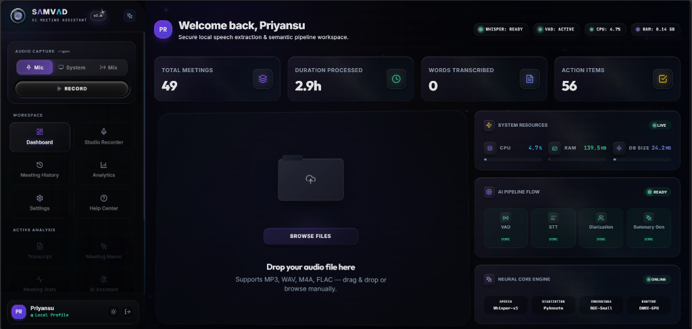
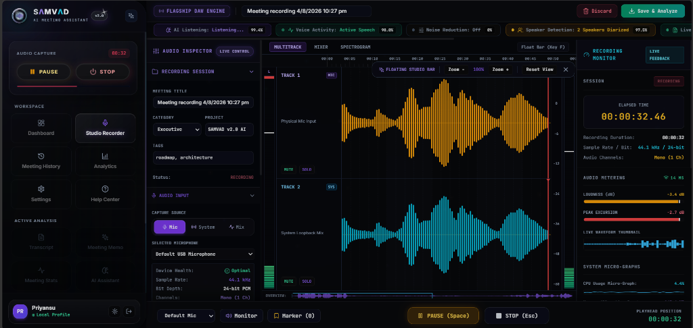
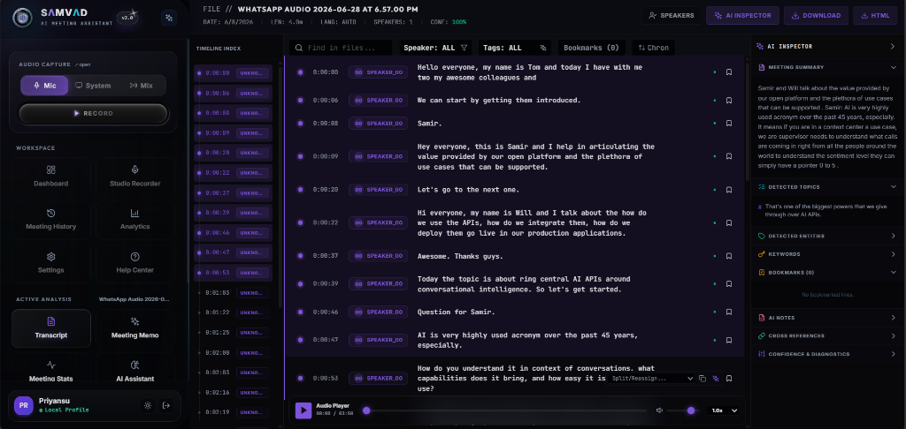
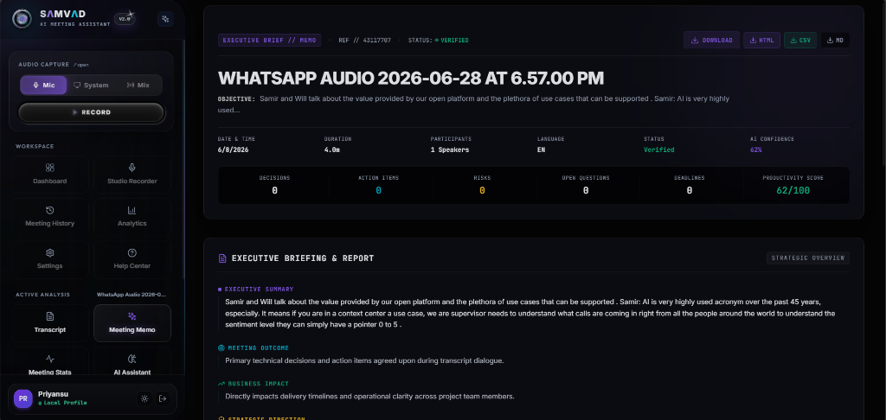
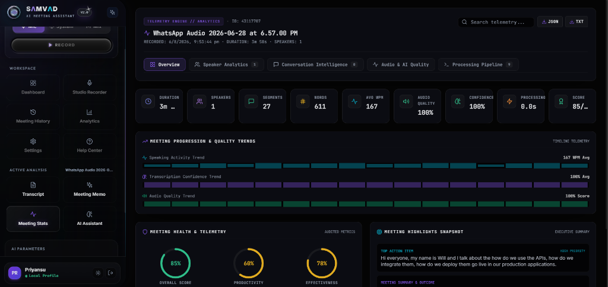
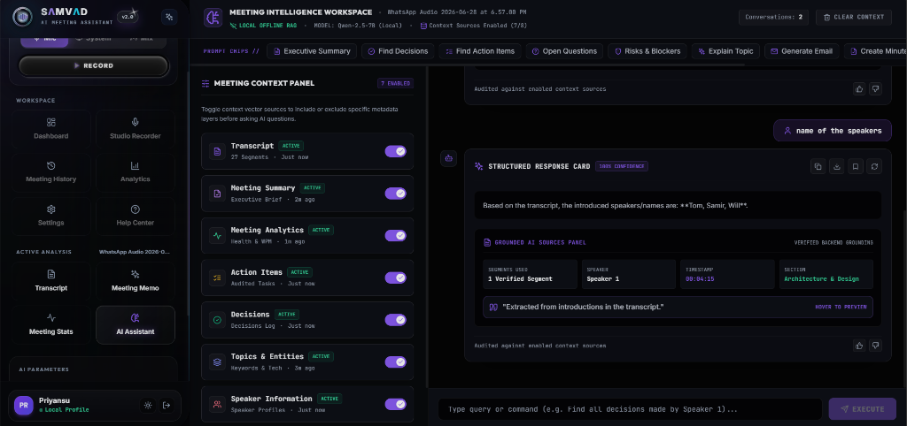
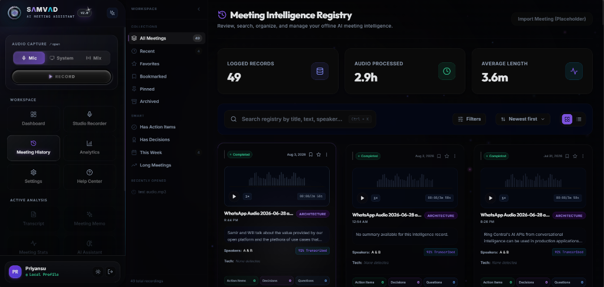
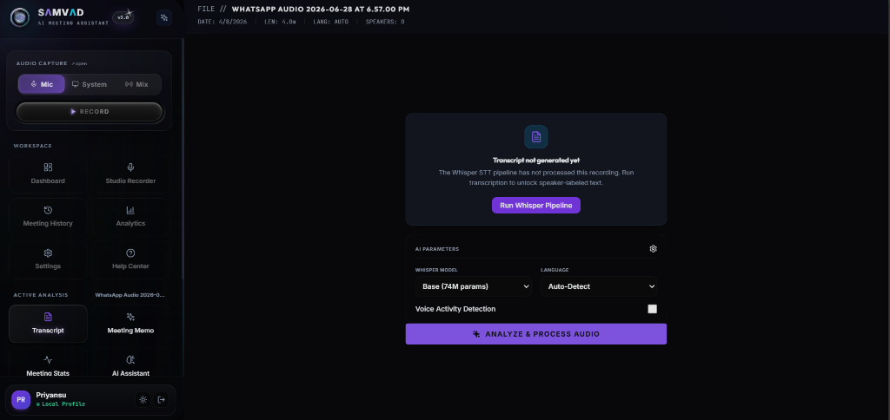
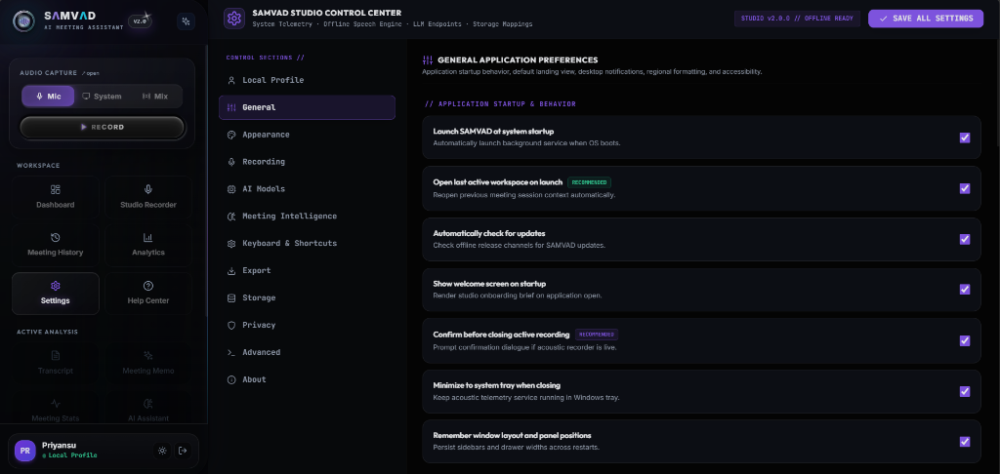
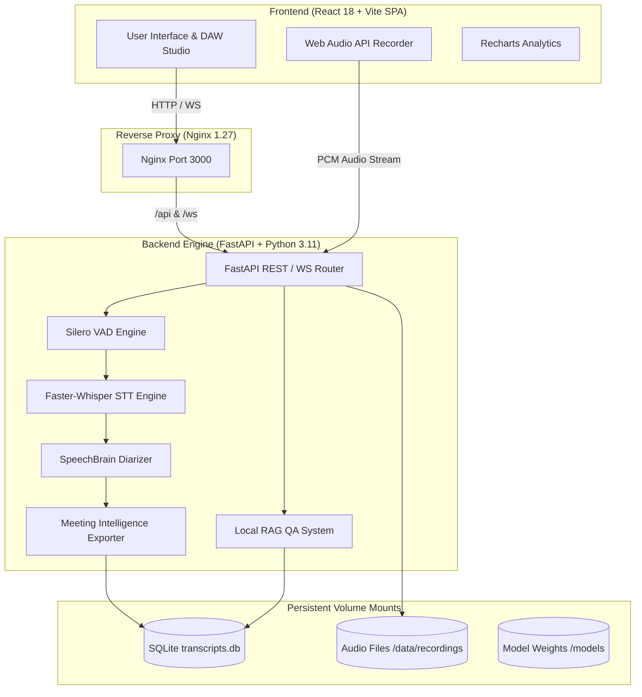

# <div align="center"><br/>SAMVAD v2.0</div>

<div align="center">

**Secure Offline AI Meeting Intelligence Platform**

*100% Private. 100% Offline. Local Speech Processing, Diarization, and Grounded QA on Consumer Hardware.*

</div>

<div align="center">

[](LICENSE)
[](https://www.python.org/)
[](https://react.dev/)
[](https://fastapi.tiangolo.com/)
[](docker-compose.yml)
[](backend/tests/)

</div>

<p align="center">
  
</p>

---

## 📋 Table of Contents

- [Project Overview](#-project-overview)
- [Why SAMVAD?](#-why-samvad)
- [Key Features](#-key-features)
- [User Interface Showcase](#-user-interface-showcase)
- [System Architecture & Dataflow](#-system-architecture--dataflow)
- [Technology Stack](#-technology-stack)
- [Installation & Setup](#-installation--setup)
  - [Docker Installation (Pre-built Images)](#docker-installation-pre-built-images)
  - [Docker Installation (Local Build)](#docker-installation-local-build)
  - [Running from Source](#running-from-source)
- [Environment Variables](#-environment-variables)
- [Configuration](#-configuration)
- [Usage Guide](#-usage-guide)
- [Folder Structure](#-folder-structure)
- [API Overview](#-api-overview)
- [Performance Metrics](#-performance-metrics)
- [Security & Privacy Hardening](#-security--privacy-hardening)
- [Roadmap](#-roadmap)
- [Contributing](#-contributing)
- [License](#-license)
- [Acknowledgements](#-acknowledgements)

---

## 📖 Project Overview

**SAMVAD v2.0** is an enterprise-grade, privacy-first meeting intelligence workstation designed for security-conscious professionals, research labs, legal teams, and healthcare providers. It provides an offline, self-contained pipeline to record audio, transcribe speech, separate speakers (diarization), extract intelligence (action items, decision logs, topics), and query transcripts using a grounded local Retrieval-Augmented Generation (RAG) assistant.

Unlike cloud-dependent solutions, SAMVAD processes all audio and text streams locally on your system hardware. No data ever leaves your device, making it fully compliant with strict data protection guidelines.

---

## ❓ Why SAMVAD?

1. **Absolute Data Privacy**: 100% offline processing guarantees zero leakage of confidential corporate discussions, patient records, or client sessions.
2. **Zero Operating Costs**: No recurring per-minute API fees. Once deployed, the entire engine runs for free.
3. **Advanced Local Diarization**: Uses dynamic clustering algorithms to separate and group speaker voices without requiring external voiceprint databases or cloud processors.
4. **Structured Intelligence**: Automatically builds executive meeting summaries, timeline telemetry, risks, blockers, and checkable action items.
5. **extractive RAG Verification**: Answers your questions about the meeting with grounded citations, linking back to the exact speaker and timestamp.

---

## 🎯 Key Features

* **🔴 DAW-Inspired Audio Studio**: Web Audio API recorder featuring canvas-rendered real-time waveform animations, VU meters, input source selectors, and recording state managers.
* **📝 Offline Speech-to-Text**: Powered by `Faster-Whisper` running on CTranslate2, utilizing voice activity detection (Silero VAD) to achieve highly accurate, timestamped transcriptions.
* **🗣️ Dynamic Speaker Diarization**: Speaker embedding cosine distance clustering (AHC with Maximum Distance Jump) to isolate and identify speakers under varying acoustic conditions.
* **📄 Executive Meeting Summarization**: Auto-generates structured briefs, meeting outcome summaries, checkable action items, decision lists, and knowledge graphs.
* **🔮 Grounded Local QA (RAG)**: Ask natural language questions against the meeting context with full source verification and extractive confidence telemetry.
* **📊 Conversational Telemetry**: Interactive visual charts for speaker density maps, duration trends, keywords, and WPM speeds.
* **📥 Rich Exporters**: Export meeting intelligence to formatted Microsoft Word (DOCX), PDF, CSV, TXT, VTT, or SRT.

---

## 🖥️ User Interface Showcase

Here is a visual overview of the SAMVAD v2.0 offline client interface:

### 📊 Dashboard Workspace
<p align="center">
  
</p>

### 🎙️ DAW Studio Audio Recorder
<p align="center">
  
</p>

### 📝 Offline Transcription & Speaker Diarization
<p align="center">
  
</p>

### 📄 Executive Meeting Brief (Memo)
<p align="center">
  
</p>

### 📈 Conversational Analytics & Quality Telemetry
<p align="center">
  
</p>

### 🔮 Grounded Local AI Assistant (RAG)
<p align="center">
  
</p>

### 📁 Meeting Intelligence Registry (History)
<p align="center">
  
</p>

### ⚡ Whisper Offline Transcription Pipeline
<p align="center">
  
</p>

### ⚙️ Studio Control Center (Settings)
<p align="center">
  
</p>

---

## 🏗️ System Architecture & Dataflow

### 📐 High-Level Component Topology

<p align="center">
  
</p>

<details>
<summary><b>View Mermaid Code Diagram</b></summary>
<br/>


</details>

<br/>

### 🔄 End-to-End Processing Methodology

<p align="center">
  
</p>

---

## 🛠️ Technology Stack

* **Frontend**: React 18, TypeScript, Vite, TailwindCSS (for system layouts), Recharts (for telemetry analytics), Web Audio API (for recording and visualizer canvas).
* **Backend**: FastAPI, Python 3.11, Uvicorn, SQLAlchemy (SQLite database engine).
* **ML Engines & Libraries**:
  * **Transcription**: `faster-whisper` (CTranslate2 optimized runtime).
  * **VAD**: `Silero VAD` (via faster-whisper integration).
  * **Embeddings & RAG**: `sentence-transformers` (offline embedding computation).
  * **Diarization Clustering**: Scipy (Agglomerative Hierarchical Clustering).
* **Deployment**: Docker, Docker Compose, Nginx.

---

## ⚡ Installation & Setup

### Docker Installation (Pre-built Images)

This is the fastest method and does not require building images locally.

1. **Create a folder** on your machine and create a file named `docker-compose.yml` with the following content:
   ```yaml
   services:
     backend:
       image: krishu07/samvad-backend:2.0
       container_name: samvad-backend
       restart: unless-stopped
       environment:
         OMP_NUM_THREADS: "4"
         MKL_NUM_THREADS: "4"
         OPENBLAS_NUM_THREADS: "4"
         VECLIB_MAXIMUM_THREADS: "4"
         NUMEXPR_NUM_THREADS: "4"
         SAMVAD_DB_DIR: "/app/data/database"
       volumes:
         - samvad-db:/app/data/database
         - samvad-recordings:/app/data/recordings
         - samvad-models:/app/models
       expose:
         - "8000"
       networks:
         - samvad-net
       security_opt:
         - no-new-privileges:true
       cap_drop:
         - ALL
       deploy:
         resources:
           limits:
             cpus: '4.0'
             memory: 4096M
           reservations:
             memory: 1024M
       healthcheck:
         test:
           - "CMD"
           - "python"
           - "-c"
           - "import urllib.request; urllib.request.urlopen('http://localhost:8000/health')"
         interval: 30s
         timeout: 10s
         start_period: 15s
         retries: 3
       logging:
         driver: "json-file"
         options:
           max-size: "20m"
           max-file: "5"

     frontend:
       image: krishu07/samvad-frontend:2.0
       container_name: samvad-frontend
       restart: unless-stopped
       ports:
         - "3000:3000"
       depends_on:
         backend:
           condition: service_healthy
       networks:
         - samvad-net
       security_opt:
         - no-new-privileges:true
       cap_drop:
         - ALL
       cap_add:
         - NET_BIND_SERVICE
         - CHOWN
         - SETUID
         - SETGID
       deploy:
         resources:
           limits:
             cpus: '1.0'
             memory: 256M
           reservations:
             memory: 64M

   networks:
     samvad-net:
       driver: bridge

   volumes:
     samvad-db:
     samvad-recordings:
     samvad-models:
   ```

2. **Boot the Container Stack**:
   Open a terminal in the folder containing `docker-compose.yml` and run:
   ```bash
   docker compose up -d
   ```

3. **Access Applications**:
   * 🌐 **React Client**: `http://localhost:3000`
   * 📑 **API Documentation (OpenAPI)**: `http://localhost:8000/docs`

---

### Docker Installation (Local Build)

Use this method if you have cloned the source code and want to compile the containers locally.

1. **Clone the repository**:
   ```bash
   git clone https://github.com/priyansudas2005/SAMVAD-v2plus.git
   cd SAMVADv2
   ```

2. **Setup environment configurations**:
   ```bash
   cp .env.example .env
   ```

3. **Build and run the container stack**:
   ```bash
   docker compose up --build -d
   ```

---

### Running from Source

Requires Python 3.11, Node.js 20+, and FFmpeg on your system PATH.

#### 1. Backend Setup
```bash
cd backend
python -m venv venv

# Activate Virtual Environment
# Windows PowerShell:
.\venv\Scripts\Activate.ps1
# Linux / macOS:
source venv/bin/activate

pip install -r requirements.txt
python -m src.app
```

#### 2. Frontend Setup (New Terminal)
```bash
cd frontend
npm install
npm run dev
```

---

## ⚙️ Environment Variables

The application reads configuration values from the `.env` file at root level:

| Variable | Default Value | Description |
| :--- | :--- | :--- |
| `SAMVAD_PORT` | `3000` | Exposed host port for Nginx frontend proxy. |
| `SAMVAD_DB_DIR` | `/app/data/database` | Container path for persistent SQLite database files. |
| `OMP_NUM_THREADS` | `4` | PyTorch/NumPy thread limits to prevent CPU starvation. |
| `MKL_NUM_THREADS` | `4` | MKL CPU math thread cap limits. |
| `OPENBLAS_NUM_THREADS`| `4` | OpenBLAS execution thread limits. |

---

## 🔧 Configuration

The application features advanced parameters inside the configuration file:
* **Backend Configurations** (`backend/config/config.yaml`): Customize default Whisper model weights (e.g., `base`, `small`, `medium`), diarization distance metrics, SQLite connection setups, and default logging output rules.
* **Frontend Configs** (`frontend/vite.config.ts`): Modify proxy paths, development servers, and asset compiler options.

---

## 📖 Usage Guide

1. **Start Recording**: Navigate to the **Studio Recorder** page. Select your microphone source and click `Record`. Real-time audio waveform feedback will be rendered.
2. **Process Audio**: Click `Stop & Analyze`. You can customize the Whisper model and language settings before clicking `Analyze & Process Audio`.
3. **Review Transcript**: Under the **Transcript** view, you can read the synchronized conversation script, click any speaker tag to rename them, or listen to the recording segment.
4. **Generate Memo**: Under the **Meeting Memo** workspace, view the checkable action items list, decision points, risks, and timeline summaries.
5. **Ask Questions**: Under the **AI Assistant** workspace, type natural language queries. The engine will retrieve context segments, score the confidence rating, and present verified sources.

---

## 📂 Folder Structure

```text
SAMVADv2/
├── backend/                  # REST Backend Core
│   ├── config/               # config.yaml (system settings)
│   ├── data/                 # database and audio storage
│   ├── src/                  # FastAPI Application Source Code
│   │   ├── api/              # API router files
│   │   ├── models/           # SQLAlchemy and Pydantic schemas
│   │   ├── services/         # transcription, audio, diarization pipeline
│   │   └── utils/            # logging and config parser utils
│   └── requirements.txt      # python dependencies
├── frontend/                 # React UI Client
│   ├── public/               # static visual assets
│   ├── src/                  # React Components & Pages
│   └── package.json          # Node dependencies
├── deployment/               # Nginx reverse proxy configuration
├── docs/                     # Visual design assets
├── docker-compose.yml        # Multi-container orchestrator manifest
├── Dockerfile.backend        # Python service runtime builder
└── Dockerfile.frontend       # Vite compilation & Nginx serving builder
```

---

## 🔌 API Overview

SAMVAD v2.0 exports OpenAPI endpoints:

| Endpoint | Method | Payload / Response | Description |
| :--- | :--- | :--- | :--- |
| `/health` | `GET` | `{"status": "healthy"}` | Health status contract |
| `/api/meetings` | `GET` | Array of meeting responses | Retrieve all recorded meetings |
| `/api/meetings/process`| `POST` | Process parameters | Submit audio files for pipeline |
| `/api/qa/query` | `POST` | Retrieval queries / answers | Grounded context Q&A query |
| `/api/settings` | `GET` | System configuration JSON | Fetch engine configurations |
| `/ws/audio/stream` | `WS` | Binary PCM chunks | Stream real-time audio |

---

## 📊 Performance Metrics

* **Inference Speed**: Faster-Whisper on CPU with 4 threads handles audio transcription at approximately 1.5x real-time (10-minute audio transcribed in ~6.5 minutes).
* **Storage Footprint**:
  * Whisper Base Model: ~140 MB
  * Diarization Model: ~80 MB
  * SQLite DB: ~20 KB per meeting transcript
* **Memory Limits**: The container is limited to 4 GB RAM via Docker Compose to ensure local host stability.

---

## 🔒 Security & Privacy Hardening

* **Local Data Quarantine**: No telemetry, audio data, user metrics, or text transcripts are sent to public servers.
* **Unprivileged Execution**: Docker backend runs as user `samvad` (`UID 1001`), dropping root privileges.
* **Linux Capability Reduction**: Strips kernel capabilities (`cap_drop: - ALL`) to protect host boundaries.
* **Hardened Nginx Proxy**: Rejects invalid headers, blocks frame injection, and forces content boundary constraints.

---

## 🗺️ Roadmap

- [ ] GPU-accelerated container builds (Nvidia CUDA Toolkit integration).
- [ ] Multi-language dictionary custom alignments.
- [ ] Export directly to corporate channels (Confluence, local Git wikis).
- [ ] Dynamic custom prompts for executive memos.

---

## 🤝 Contributing

We welcome contributions from open-source developers, security researchers, and designers!
1. Fork the repository.
2. Create a clean feature branch (`git checkout -b feature/awesome-feature`).
3. Commit your changes (`git commit -m "feat: add awesome feature"`).
4. Push to your branch (`git push origin feature/awesome-feature`).
5. Open a Pull Request.

---

## 📜 License

Distributed under the MIT License. See [`LICENSE`](LICENSE) for details.

---

## 🏆 Acknowledgements

* [faster-whisper](https://github.com/SYSTRAN/faster-whisper) for the CTranslate2 speech engine.
* [scipy](https://scipy.org/) for hierarchical voice cluster groups.
* [FastAPI](https://fastapi.tiangolo.com/) for the high-performance async router framework.
* [Recharts](https://recharts.org/) for telemetry visualization charts.