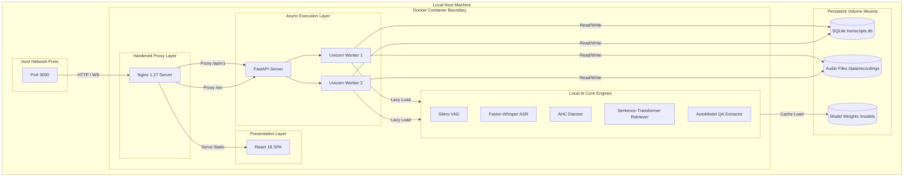
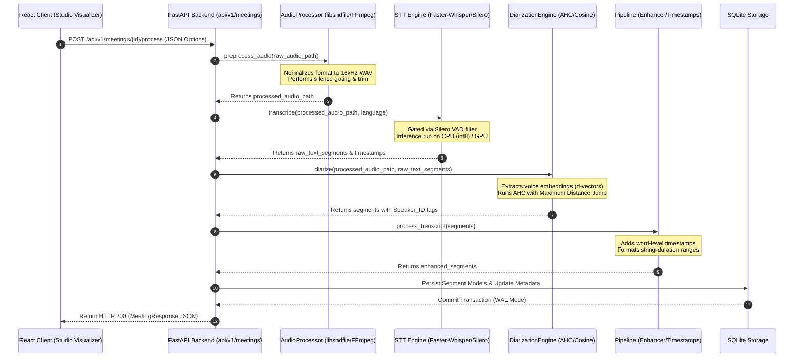

# SAMVAD v2.0 System Architecture

This document provides a comprehensive technical overview of **SAMVAD v2.0**'s system architecture, components, data flows, and design decisions.

---

## 🏗️ 1. High-Level Architecture

SAMVAD v2.0 is designed as a **100% offline, local-first meeting intelligence workstation**. The system utilizes a modular multi-container architecture composed of three primary layers:
1. **Presentation Layer**: A client-side Single Page Application (SPA) built with React, TypeScript, and Vite.
2. **Gateway & Proxy Layer**: An Nginx reverse proxy serving the static frontend assets and routing API and WebSocket channels.
3. **Execution Layer**: An asynchronous FastAPI backend orchestrating local speech processing pipelines and database persistence.

### 📐 Component Topology



---

## 🔄 2. End-to-End Speech & Analysis Pipeline Data Flow

When a user submits an audio recording or finishes a live session, the system routes the raw binary stream through a sequence of local intelligence steps:



---

## 🔮 3. Local RAG & Q&A Pipeline

The RAG pipeline operates completely offline, allowing semantic searches against transcript chunks using local deep-learning embeddings.

```mermaid
graph TD
    subgraph Client ["Client (React UI)"]
        Q[User Query Input]
        R[Render Structured Response Card]
    end

    subgraph RAGCore ["FastAPI RAG Service"]
        SE[SentenceTransformer Encoder]
        DBQ[SQLite Query Fetcher]
        SIM[Cosine Similarity Matcher]
        QA[AutoModelForQA Reader]
    end

    subgraph Storage ["SQLite Volumes"]
        DB[(Transcripts Table)]
    end

    Q -->|POST /api/v1/meetings/{id}/qa| SE
    SE -->|Compute Query Vector| SIM
    DBQ -->|Load Transcript Chunks| SIM
    DB -->|Read Chunks| DBQ
    SIM -->|Filter Top-K Relevant Nodes| QA
    QA -->|Tokenize & Run Reading Comprehension| R
    Note over QA: Outputs Answer Snippet,<br/>Confidence Score,<br/>and Target Citations Source
```

---

## 📂 4. Folder Responsibilities

```text
SAMVADv2/
├── .github/                  # CI/CD workflows and issue/PR templates
├── backend/                  # Python FastAPI Core
│   ├── config/               # config.yaml (Whisper and system parameters)
│   ├── data/                 # SQLite database and local audio recordings volumes
│   ├── src/                  # Application Logic
│   │   ├── api/              # REST controllers and websocket endpoints
│   │   ├── models/           # SQLAlchemy schemas and Pydantic validators
│   │   ├── services/         # Machine Learning pipeline components
│   │   │   ├── audio/        # Audio processing, FFmpeg formats & VU level meters
│   │   │   ├── database/     # SQLAlchemy sessions, engine configs & WAL pragmas
│   │   │   ├── diarization/  # Voice embeddings cosine clustering (AHC)
│   │   │   ├── export/       # Document compilers (PDF, DOCX, CSV, SRT)
│   │   │   ├── intelligence/ # Segment parsing, checks & summaries models
│   │   │   ├── qa/           # Cosine retriever and RoBERTa reading QA
│   │   │   ├── summary/      # Memo generators and rule fallbacks
│   │   │   └── transcription/# Faster-Whisper execution and loader locks
│   │   └── utils/            # Configurations parsing & Loguru configurations
│   └── tests/                # Pytest mock tests suites
├── frontend/                 # React SPA Core
│   ├── public/               # Static public assets (SVGs, logos)
│   ├── src/                  # UI Components
│   │   ├── components/       # DAW recorders, waveforms, VU levels & charts
│   │   ├── pages/            # Workspace page layouts (QA, Memo, Stats, Settings)
│   │   ├── services/         # api.ts fetch wrappers & WebSockets clients
│   │   └── types/            # TypeScript schemas interfaces
│   └── package.json          # Node dependencies
├── deployment/               # Nginx server reverse proxy configuration files
└── docs/                     # Wiki guides, release notes, and diagrams
```

---

## 🛠️ 5. Key Design Decisions

### 1. Lazy Loading Singleton ML Models
* **Decision**: We run model loading lazily on demand (`loader.py` locks) instead of eagerly on startup.
* **Rationale**: Eager loading causes backend container health checks to time out if models take time to load or download. Lazy loading allows the server to start instantly, register health status, and load weights into memory only during execution.

### 2. Multi-Worker Uvicorn Processes
* **Decision**: Configured Uvicorn with `--workers 2` inside `Dockerfile.backend`.
* **Rationale**: Python's Global Interpreter Lock (GIL) blocks execution threads during heavy CPU computations. Running two worker processes allows Uvicorn to distribute requests: while Worker 1 is occupied running Whisper STT calculations, Worker 2 remains responsive to answer client WebSocket visualizer pings.

### 3. SQLite WAL Connection Tuning
* **Decision**: Engaged database connection events enforcing `journal_mode=WAL` (Write-Ahead Logging) and `pool_pre_ping=True`.
* **Rationale**: Traditional SQLite locks the database file on write calls, throwing "database is locked" errors. WAL mode decouples read and write locks, permitting concurrent reading threads to query data without blocking active processing writes.

### 4. CPU-Only PyTorch Dependency Pinning
* **Decision**: Overrode PyTorch default installation commands to target the CPU-only wheels registry inside `Dockerfile.backend`.
* **Rationale**: The standard PyTorch build bundles CUDA binaries exceeding 2.5 GB. Overriding to the CPU wheel index reduced image sizes from 4.5 GB to 1.85 GB (a 58% footprint reduction), making deployment lightweight on consumer hardware.

---

## 📈 6. Future Scalability Paths

While SAMVAD is currently tuned for local, self-contained single-node workspaces, its modular architecture makes it easy to scale horizontally for multi-user networks:

1. **Decouple the ML Inference Engine**:
   - Move Whisper, Diarization, and embedding pipelines out of the FastAPI process and into a dedicated model server (such as Triton Inference Server or vLLM).
   - This decouples API routing from CPU/GPU-intensive tasks, allowing you to scale backend API processes independently of hardware clusters.
2. **Transition to PostgreSQL / pgvector**:
   - Replace SQLite with PostgreSQL for transactional data.
   - Replace the custom cosine similarity retriever in `retriever.py` with `pgvector` index queries to support scalable, vector-based RAG searches across thousands of meetings.
3. **Queue-Based Async Processing**:
   - Replace blocking thread loops with a message queue (such as Celery, Redis, or RabbitMQ) to handle analysis tasks asynchronously.
   - The backend API can return a task ID instantly, allowing worker nodes to pull and process audio files from the queue without blocking HTTP requests.
